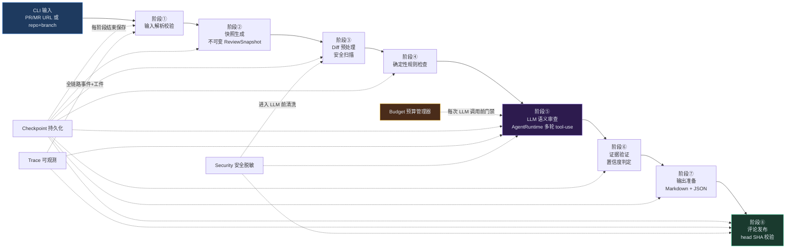
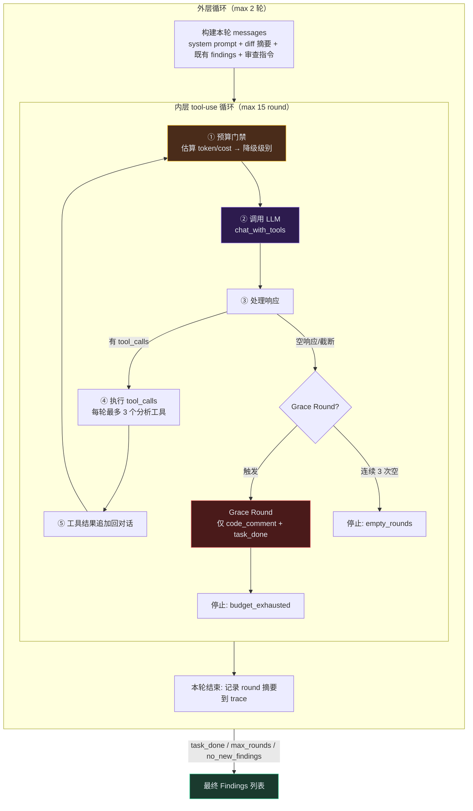
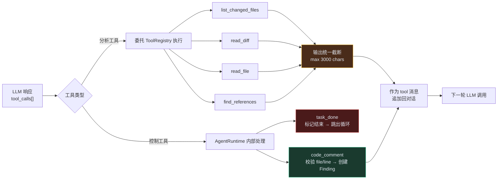
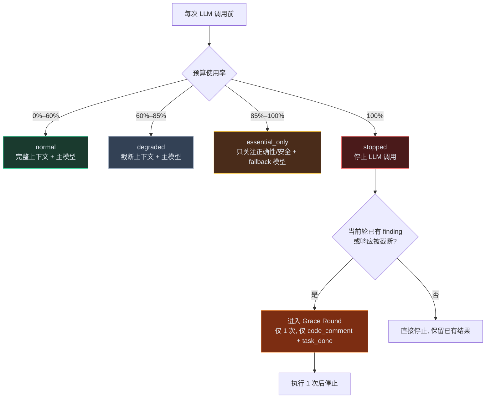

# Code Review Agent (Take-Home)

> 面试 Take-Home 项目：构建一个可靠的 Code Review Agent，接收 GitHub PR / GitLab MR，产出有证据支撑的审查评论。
>
> 输入：PR/MR 链接，或 `repo + branch`。
> 输出：直接回评到 PR/MR，或落地为 Markdown 报告。

---

## 题目要求与实现对照

题目明确提出 6 项硬性要求，以下逐条对应实现状态：

| # | 题目要求 | 实现方式 | 关键文件 | 状态 |
|---|---|---|---|---|
| 1 | **可恢复**：断网/重启不从头跑，有 checkpoint | 8 阶段 Pipeline，每阶段结束保存 Checkpoint；支持从任意阶段 `resume`，不重复已完成的模型调用，不重置预算 | `services/review_runner.py` `services/checkpoint_manager.py` | ✅ |
| 2 | **token 预算**：总预算可设（如 10 元/MR），超预算自动降级模型或截断 | 共享 Token + 成本双预算；四级降级（normal → degraded → essential_only → stopped）；超预算进入 grace round 保守收尾 | `services/budget_manager.py` `adapters/llm/budget_routed.py` | ✅ |
| 3 | **可观测**：每条评论关联一条 trace（工具、原始 diff、prompt、模型回复） | Trace 记录执行事件 + 脱敏原始工件（prompt/response/工具调用）；每条 Finding 绑定证据引用，可追溯到输入快照→工具→模型响应 | `services/trace_manager.py` `domain/models.py` | ✅ |
| 4 | **置信度分级**："高置信度可直接采纳"（来源指向规则/测试）与"仅供参考"两类 | `EvidenceValidator` 基于证据类型独立判定：有 verified 证据 → `high`（可直接采纳）；无充分证据 → `reference`（仅供参考）；不依赖模型自报 | `services/evidence_validator.py` `services/comment_locator.py` | ✅ |
| 5 | **安全**：不能把 secret 上传 LLM；不能在用户仓库跑任意代码 | 全链路 Secret 脱敏（Prompt/输出/Trace/Checkpoint/评论）；默认禁止执行用户仓库代码；工具白名单制，不暴露任意 Shell | `services/security.py` `tools/` | ✅ |
| 6 | **可扩展**：新增工具（如 typecheck）是声明式注册，不改主流程 | `@tool` 装饰器 + 类型注解自动生成 JSON Schema；受控目录自动发现；新增工具只需写一个函数，不改 `AgentRuntime` 或 `ReviewRunner` | `tools/declarative.py` `tools/registry.py` `tools/auto_discover.py` | ✅ |

---

## 目录

- [快速开始](#快速开始)
- [核心架构](#核心架构)
- [六项要求实现详解](#六项要求实现详解)
- [项目结构](#项目结构)
- [测试与验证](#测试与验证)
- [交付物清单](#交付物清单)
- [已知边界与非目标](#已知边界与非目标)
- [文档索引](#文档索引)

---

## 快速开始

### 环境要求

- Python >= 3.12
- 一个 OpenAI-compatible LLM API（DeepSeek / OpenAI / 通义千问等）
- GitHub Token 或 GitLab Token（按需）

### 安装与配置

```powershell
pip install -e .

# ===== LLM 主模型（必填）=====
$env:LLM_PRIMARY_API_KEY = "sk-xxxxxxxx"
$env:LLM_PRIMARY_BASE_URL = "https://api.deepseek.com"
$env:LLM_PRIMARY_MODEL = "deepseek-v4-pro"
$env:LLM_PRIMARY_TIMEOUT_SECONDS = "120"

# ===== LLM 降级模型（预算超 60% 时自动切换，可选但建议配置）=====
$env:LLM_FALLBACK_API_KEY = "sk-xxxxxxxx"
$env:LLM_FALLBACK_BASE_URL = "https://api.deepseek.com"
$env:LLM_FALLBACK_MODEL = "deepseek-v4-flash"
$env:LLM_FALLBACK_TIMEOUT_SECONDS = "120"

# ===== 预算（可选，有默认值）=====
$env:LLM_MAX_TOTAL_TOKENS = "80000"     # 默认 20000
$env:LLM_MAX_TOTAL_COST = "20"          # 默认 5.0（单位：元）

# ===== SCM Token（按需配置）=====
$env:GITHUB_TOKEN = "ghp_xxxxxxxx"
$env:GITLAB_TOKEN = "glpat-xxxxxxxx"
$env:GITHUB_TIMEOUT_SECONDS = "120"     # 默认 10
$env:GITLAB_TIMEOUT_SECONDS = "120"     # 默认 10

# ===== 发布开关（可选，默认 false）=====
# $env:PUBLISH_ENABLED = "true"
```

> **兼容说明**：`LLM_PRIMARY_API_KEY` / `LLM_PRIMARY_BASE_URL` / `LLM_PRIMARY_MODEL` 也兼容旧名 `LLM_API_KEY` / `LLM_BASE_URL` / `LLM_MODEL`。未配置 fallback 时，降级阶段复用主模型配置。

### 运行一次 Review

```powershell
# 方式一：PR/MR 链接
$env:PYTHONPATH = "src"
python -m codereviewer.app.cli --review-url https://github.com/owner/repo/pull/123 --artifact-root artifacts

# 方式二：repo + branch
$env:PYTHONPATH = "src"
python -m codereviewer.app.cli --provider github --repo owner/repo --base-branch main --head-branch feature/my-change --artifact-root artifacts
```

### 从 Checkpoint 恢复（可恢复）

```powershell
$env:PYTHONPATH = "src"
python -m codereviewer.app.cli --resume-review-id review-xxxxxxxx --artifact-root artifacts
```

### 启用评论发布

默认不发布。需同时满足：输入为 `--review-url` + 指定 `--publish` + 发布前 head SHA 校验通过。

```powershell
$env:PYTHONPATH = "src"
python -m codereviewer.app.cli --review-url https://github.com/owner/repo/pull/123 --publish --artifact-root artifacts
```

### 输出产物

```
artifacts/reviews/{review_id}/
├── checkpoint.json      # 阶段状态 + 预算 + 下一步动作（用于恢复）
├── findings.json        # 结构化审查结论
├── report.md            # 人类可读的 Markdown 报告
├── trace.json           # 执行 Trace（事件 + 工件引用）
└── trace_artifacts/     # 脱敏的 Prompt / 模型回复 / 工具调用原始工件
```

---

## 核心架构

### 整体数据流（Mermaid）



### 8 阶段 Pipeline

```
输入校验 → 快照生成 → Diff预处理 → 规则检查 → LLM审查 → 证据验证 → 输出准备 → 评论发布
   ①          ②           ③          ④          ⑤          ⑥          ⑦          ⑧
```

每个阶段是恢复的最小单元，阶段结束自动保存 Checkpoint。

### 分层架构

```
┌──────────────────────────────────────────┐
│ 接入层   CLI / 输入解析 / 参数校验          │
├──────────────────────────────────────────┤
│ 编排层   ReviewRunner 状态机 / 预算 / 恢复  │
├──────────────────────────────────────────┤
│ 能力层   SCM / 快照 / 工具 / 规则 / LLM /  │
│          证据 / 安全 / 输出                │
├──────────────────────────────────────────┤
│ 持久化层  Checkpoint / Trace / Artifact   │
├──────────────────────────────────────────┤
│ 领域层   Pydantic 模型 / Protocol 接口     │
└──────────────────────────────────────────┘
```

### 单 Agent 多轮 tool-use 审查

阶段 ⑤ 由 `AgentRuntime` 驱动，模型可以主动调用工具获取上下文，而非"看一眼 diff 就输出结论"：

- **分析工具**：`read_diff` / `read_file` / `list_changed_files` / `find_references`
- **控制工具**：`code_comment`（提交候选评论）/ `task_done`（结束）
- 外层最多 2 轮，内层最多 15 个 tool round
- 通过空响应上限、轮次上限和预算控制终止

---

## Agent 工作流结构

`AgentRuntime` 采用**外层多轮 + 内层 tool-use** 的双层循环，是整个审查系统的核心执行引擎。

### 双层循环架构（Mermaid）



### 工具调用与执行流程（Mermaid）



### 预算四级降级（Mermaid）



### 工作流总览

```
┌─────────────────────────────────────────────────────────────────┐
│                      外层循环（max 2 轮）                         │
│                                                                 │
│  ┌───────────────────────────────────────────────────────────┐  │
│  │  构建本轮 messages                                          │  │
│  │  ┌─────────────────────────────────────────────────────┐  │  │
│  │  │ system prompt（审查原则/严重程度/工具使用指南/禁止事项）│  │  │
│  │  │ user content                                         │  │  │
│  │  │  ├─ 变更摘要（文件数/新增行/删除行/文件列表）          │  │  │
│  │  │  ├─ 规则引擎已发现问题（第 1 轮注入，避免重复）        │  │  │
│  │  │  ├─ 上一轮已确认问题（第 2 轮注入，避免重复）          │  │  │
│  │  │  ├─ Diff 内容（脱敏后，截断 12000 chars）             │  │  │
│  │  │  └─ 审查指令                                          │  │  │
│  │  └─────────────────────────────────────────────────────┘  │  │
│  │                                                           │  │
│  │  ┌───────────────────────────────────────────────────┐   │  │
│  │  │          内层 tool-use 循环（max 15 round）         │   │  │
│  │  │                                                   │   │  │
│  │  │  ① 预算门禁 → 估算 token/cost → 决定降级级别        │   │  │
│  │  │     ├─ normal/degraded/essential_only → 继续       │   │  │
│  │  │     ├─ stopped + 有 finding → 进入 Grace Round     │   │  │
│  │  │     └─ stopped + Grace Round 已用 → 停止           │   │  │
│  │  │                                                   │   │  │
│  │  │  ② 调用 LLM（chat_with_tools，传入 tools schema）   │   │  │
│  │  │     ├─ 记录 prompt/response 到 trace artifacts     │   │  │
│  │  │     └─ 记录实际 token/cost 使用量                  │   │  │
│  │  │                                                   │   │  │
│  │  │  ③ 处理响应                                        │   │  │
│  │  │     ├─ finish_reason=length 且空 → Grace Round/停止│   │  │
│  │  │     ├─ 无 tool_calls → empty_rounds++              │   │  │
│  │  │     │   └─ 连续 3 次空响应 → 停止                  │   │  │
│  │  │     └─ 有 tool_calls → 逐个执行（见下方）           │   │  │
│  │  │                                                   │   │  │
│  │  │  ④ 执行 tool_calls（每轮最多 3 个分析工具）          │   │  │
│  │  │     ├─ code_comment → 校验参数 → 创建 Finding      │   │  │
│  │  │     ├─ task_done → 标记结束 → 跳出循环             │   │  │
│  │  │     └─ 分析工具 → 委托 ToolRegistry → 结果截断     │   │  │
│  │  │                                                   │   │  │
│  │  │  ⑤ 工具结果作为 tool 消息追加回对话 → 回到 ①        │   │  │
│  │  └───────────────────────────────────────────────────┘   │  │
│  │                                                           │  │
│  │  本轮结束：记录 round 摘要到 trace                        │  │
│  └───────────────────────────────────────────────────────────┘  │
│                                                                 │
│  外层终止：task_done / budget_exhausted / empty_rounds /        │
│           response_truncated / no_new_findings / max_rounds     │
└─────────────────────────────────────────────────────────────────┘
```

### 双层循环设计

| 循环 | 上限 | 目的 | 关键行为 |
|---|---|---|---|
| **外层** | 2 轮 | 分阶段深入审查，避免遗漏 | 第 2 轮注入第 1 轮已确认 finding，要求模型挖掘新问题 |
| **内层** | 15 tool round | 单轮内多轮工具调用，逐步获取上下文 | 模型主动调工具 → 拿到结果 → 继续分析或提交评论 |

### 工具分类与执行

```
工具
├── 控制工具（AgentRuntime 内部直接处理）
│   ├── code_comment   提交一条候选审查评论
│   │   ├─ 校验：file 必须在 changed_files 中
│   │   ├─ 校验：line 必须为正整数
│   │   ├─ 创建 Finding（confidence=REFERENCE，绑定 agent_tool_call 证据）
│   │   └─ 返回 accepted=True + finding_id
│   └── task_done      声明审查完成
│       └─ 跳出内层循环，stop_reason="task_done"
│
└── 分析工具（委托 ToolRegistry 执行）
    ├── list_changed_files   列出变更文件
    ├── read_diff            读取指定文件的 diff
    ├── read_file            读取指定文件完整内容
    └── find_references      查找符号引用
    ├─ 输出自动截断到 3000 chars
    ├─ 异常自动映射为结构化 ToolResult
    └─ 每轮最多调用 3 个分析工具（防止无限探索）
```

### 预算门禁与 Grace Round

每次 LLM 调用前执行预算检查，四级降级：

```
预算使用率
  0%–60%   → normal         完整上下文，主模型
  60%–85%  → degraded       截断上下文，主模型
  85%–100% → essential_only 只关注正确性/安全，fallback 模型
  100%     → stopped        停止 LLM 调用
                │
                ├─ 当前轮已有 finding → 进入 Grace Round（仅 1 次）
                │   ├─ 只保留 code_comment + task_done
                │   ├─ 注入 system 消息："预算即将耗尽，请提交已确认问题后结束"
                │   └─ 执行 1 次后停止
                │
                └─ 无 finding → 直接停止，保留已有结果
```

Grace Round 也可由 **LLM 响应被截断**（`finish_reason=length` 且空内容）触发，防止上下文过长导致模型无法正常输出。

### 终止条件汇总

| 终止原因 | 触发位置 | 说明 |
|---|---|---|
| `task_done` | 内层 | 模型主动调用 task_done，正常完成 |
| `budget_exhausted` | 内层 | 预算耗尽且 Grace Round 已执行 |
| `empty_rounds` | 内层 | 连续 3 次 LLM 响应无 tool_calls |
| `response_truncated` | 内层 | 响应被截断且 Grace Round 已执行 |
| `no_new_findings` | 外层 | 本轮未产生任何新 finding，提前结束 |
| `max_rounds` | 外层 | 达到 2 轮上限 |

### 一条 Finding 的完整产生链路

```
模型调用 read_file 读取 src/foo.py
  → ToolRegistry 执行，返回文件内容（截断到 3000 chars）
  → 结果作为 tool 消息追加回对话
  → 模型分析后调用 code_comment(file="src/foo.py", line=42, summary="...", ...)
  → AgentRuntime 校验 file 在 changed_files 中
  → 创建 Finding：
      id=agent-xxxxxxxxxx
      confidence=REFERENCE（初始，阶段⑥证据验证后可能升级为 HIGH）
      evidence=[EvidenceRef(source_type="agent_tool_call", source_id=tool_call_id, ...)]
      source_type=LLM
  → 返回 accepted=True
  → 模型继续分析或调用 task_done
```

阶段 ⑥ `EvidenceValidator` + `CommentLocator` 会对 AgentRuntime 产出的 Finding 做二次校验：
- `CommentLocator` 校验 `file/line` 是否映射到 diff 新增行 → 无效则降级为 `reference`
- `EvidenceValidator` 基于证据类型最终判定 `high` / `reference`
- `FindingAggregator` 去重、合并、与规则引擎产出的 Finding 聚合

---

## 六项要求实现详解

### 1. 可恢复（Checkpoint & Resume）

- 8 个稳定阶段，每阶段结束写入 `checkpoint.json`
- Checkpoint 包含：review_id、输入哈希、base/head SHA、已完成阶段、已收集 Findings、预算状态、trace_id、下一步动作
- 恢复时：校验输入哈希 → 校验 head SHA → 恢复预算 → 跳过已完成阶段 → 从 `next_action` 继续
- **不重置预算，不重复已完成的模型调用**
- 一个 Commit 的 Checkpoint 不能静默应用到另一个 Commit（head SHA 校验）

### 2. Token 预算

- 每次 Review 一个共享预算池，所有模型调用共用
- 支持 Token 预算和成本预算双维度（如 `LLM_MAX_TOTAL_COST=20` 元/MR）
- **四级降级策略**：

| 使用率 | 级别 | 行为 |
|---|---|---|
| 0%–60% | normal | 正常审查，完整上下文 |
| 60%–85% | degraded | 截断上下文，优先高信号 Finding |
| 85%–100% | essential_only | 只关注正确性/安全问题 |
| 100% | stopped | 停止 LLM 调用，保留已有结果 |

- `BudgetRoutedLLMProvider` 根据降级级别自动切换模型（正常模型 → 低成本模型）
- 预算耗尽但当前轮已有 Finding 时，进入 **grace round**：只允许 `code_comment` + `task_done`，不再允许分析工具
- 禁止静默增加预算

### 3. 可观测（Trace）

- 每条评论（Finding）可追溯完整链路：输入快照 → 调用了哪些工具 → 原始 diff 片段 → Prompt → 模型回复 → 证据引用
- Trace 不是纯文本日志，而是**事件 + 脱敏原始工件引用**：
  - `trace.json` 记录执行事件和工件索引
  - `trace_artifacts/` 保存脱敏后的 Prompt、模型回复、工具输入输出
- 覆盖事件：Review 初始化、输入校验、快照创建、工具调用、模型调用、证据校验、输出准备、发布尝试、失败中断
- 所有工件写入前经过 Secret 脱敏

### 4. 置信度分级

两级置信度，由 `EvidenceValidator` 基于证据类型**独立判定**，不依赖模型自报：

| 置信度 | 含义 | 判定条件 |
|---|---|---|
| `high` | 高置信度，可直接采纳 | 有任意 `verified=True` 的证据（规则命中、Diff 行、文件内容） |
| `reference` | 仅供参考 | 问题合理但缺少充分直接证据 |

- 无证据的结论被过滤，不进入正式输出
- `CommentLocator` 校验评论的 `file/line` 是否映射到 diff 新增行；定位无效的 Finding 降级为 `reference`
- 规则引擎产出的 Finding 自带 `verified=True` 证据，天然为 `high` 置信度

### 5. 安全

**Secret 保护**：

- 检测并脱敏：GitHub Token（`ghp_`/`github_pat_`）、GitLab Token（`glpat-`）、OpenAI Key（`sk-`）、私钥
- 脱敏覆盖所有出口：LLM Prompt、模型回复、Markdown 报告、Provider 评论、Trace、Checkpoint、控制台日志、错误消息
- 发送给 LLM 前跳过 `.env` 等 Secret 配置文件

**代码执行保护**：

- 默认禁止执行用户仓库代码（不运行测试、Typecheck、构建、脚本）
- 不向模型暴露任意 Shell 工具
- 工具白名单制，只有显式注册的只读工具可被调用
- 模型不能自行选择命令、凭据或执行权限

### 6. 可扩展（声明式工具注册）

新增工具 = 写一个带 `@tool` 的函数，**不改主流程**：

```python
from codereviewer.domain.models import ToolExecutionContext
from codereviewer.tools.declarative import tool

@tool(
    name="run_typecheck",
    description="Run type checker on the changed files and return errors.",
    execution_policy="isolated_read_only",
    max_output_chars=8000,
    failure_behavior="return_error",
)
def run_typecheck(context: ToolExecutionContext, files: list[str]) -> dict[str, object]:
    # 工具实现
    return {"errors": [...]}
```

- JSON Schema 由函数签名 + 类型注解自动生成
- `ToolExecutionContext`（snapshot/provider/budget/trace）通过参数注入，不暴露给 LLM
- 内置工具通过 `discover_and_register()` 从受控目录自动发现
- 每个工具必须定义：稳定名称、能力描述、输入 Schema、有界输出、执行策略、最大输出大小、失败行为
- 新增工具不需要修改 `AgentRuntime` 或 `ReviewRunner`

---

## 项目结构

```
bytedance-codereviewer/
├── src/codereviewer/
│   ├── app/
│   │   ├── cli.py                  # CLI 入口
│   │   └── pipeline.py
│   ├── domain/
│   │   ├── models.py               # Pydantic 领域模型（Finding/Snapshot/BudgetState/...）
│   │   ├── enums.py                # Severity / Confidence / ReviewStage / ...
│   │   ├── errors.py               # 自定义异常体系
│   │   └── interfaces/             # Protocol 接口（SCM/LLM/Tool/Store）
│   ├── adapters/
│   │   ├── scm/
│   │   │   ├── github.py           # GitHub Provider
│   │   │   └── gitlab.py           # GitLab Provider
│   │   ├── llm/
│   │   │   ├── openai_compatible.py  # LLM 适配（支持 function calling）
│   │   │   └── budget_routed.py      # 预算路由装饰器
│   │   └── storage/
│   │       └── file_store.py       # 本地文件存储
│   ├── services/
│   │   ├── review_runner.py        # 8 阶段 Pipeline 编排（run/resume）
│   │   ├── agent_runtime.py        # 单 Agent 多轮 tool-use 审查
│   │   ├── budget_manager.py       # 共享预算 + 四级降级
│   │   ├── checkpoint_manager.py   # 阶段持久化与恢复
│   │   ├── trace_manager.py        # 执行事件 + 脱敏工件记录
│   │   ├── security.py             # Secret 全链路脱敏
│   │   ├── rule_engine.py          # 确定性规则检查（high 置信度来源）
│   │   ├── evidence_validator.py   # 证据校验 + 置信度独立判定
│   │   ├── comment_locator.py      # 评论 file/line 定位校验
│   │   ├── finding_aggregator.py   # Finding 去重、合并、置信度收敛
│   │   ├── publish_controller.py   # 评论发布 + head SHA 校验
│   │   ├── input_resolver.py       # 输入解析与校验
│   │   ├── snapshot_builder.py     # 不可变快照构建
│   │   ├── diff_preprocessor.py    # Diff 分片、过滤、语言识别
│   │   ├── tool_engine.py          # 工具执行引擎（规则链路兼容）
│   │   ├── llm_provider_factory.py # LLM Provider 工厂 + 预算路由
│   │   └── scm_provider_factory.py # SCM Provider 工厂（GitHub/GitLab）
│   ├── tools/
│   │   ├── declarative.py          # @tool 装饰器 + Schema 自动生成
│   │   ├── registry.py             # ToolRegistry 注册与执行
│   │   ├── auto_discover.py        # 受控目录自动发现
│   │   └── builtin/                # 内置只读工具
│   │       ├── read_diff.py
│   │       ├── read_file.py
│   │       ├── list_changed_files.py
│   │       └── find_references.py
│   ├── reporters/
│   │   ├── markdown.py             # Markdown 报告渲染
│   │   ├── json_output.py          # findings.json 输出
│   │   └── comment.py              # Provider 评论载荷构造
│   └── config.py
├── tests/unit/                     # 118 个单元测试
├── docs/                           # 设计文档
├── artifacts/                      # 运行产物
├── pyproject.toml
├── AGENTS.md                       # 开发协作规范
└── README.md
```

---

## 测试与验证

```
119 passed
```

28 个测试文件，覆盖题目 6 项要求的核心行为：

| 测试文件 | 覆盖的题目要求 |
|---|---|
| `test_resume_flow.py` | 可恢复：从各阶段恢复、预算恢复、不重复调用 |
| `test_checkpoint_manager.py` | 可恢复：保存/加载/输入哈希校验 |
| `test_budget_manager.py` | 预算：四级降级阈值、预决策、超预算停止 |
| `test_budget_routed_llm_provider.py` | 预算：降级驱动模型切换 |
| `test_agent_runtime.py` | 可观测/可扩展：多轮 tool-use、grace round、空响应终止 |
| `test_trace_manager.py` | 可观测：事件记录、工件引用 |
| `test_evidence_validator.py` | 置信度：证据校验、high/reference 独立判定 |
| `test_comment_locator.py` | 置信度：定位有效/无效、降级为 reference |
| `test_security.py` | 安全：Secret 脱敏、各出口覆盖 |
| `test_declarative_tools.py` | 可扩展：@tool 装饰器、Schema 生成、上下文注入 |
| `test_builtin_tools.py` | 可扩展：4 个内置工具的成功/失败/截断 |
| `test_tool_registry.py` | 可扩展：重复注册拒绝 |
| `test_pipeline_smoke.py` | 全流程端到端 |
| `test_publish_controller.py` | 发布开关、head SHA 校验 |
| `test_github_provider.py` / `test_gitlab_provider.py` | 双 Provider 输入解析与 API 调用 |
| `test_openai_compatible_llm_provider.py` | function calling / tool_calls 解析 |
| `test_finding_aggregator.py` | 去重、合并、hybrid 标记 |
| `test_rule_engine.py` | 规则命中/无命中、证据绑定 |

---

## 交付物清单

根据题目"你需要判断要发给我哪些东西"，本项目交付以下内容：

| 交付物 | 说明 |
|---|---|
| **源代码** | `src/` 全部源码，纯 Python + Pydantic，无重型框架依赖 |
| **测试** | `tests/unit/` 119 个测试，`pytest` 一键运行 |
| **设计文档** | `docs/` 下 SPEC / ARCHITECTURE / DEV_PLAN / spec2 / AGENT_RUNTIME / DECLARATIVE_TOOLS / CHECKLIST / mvp_review |
| **README** | 本文件，题目要求逐条对照 + 快速开始 + 架构说明 |
| **AGENTS.md** | 开发协作规范（架构约束、编码纪律、开发流程） |
| **运行产物** | 运行后生成在 `artifacts/`（已 gitignore，不随代码推送），含 checkpoint/findings/report/trace |

打包方式：将整个项目目录（排除 `.git/`、`__pycache__/`、`.pytest_cache/`）压缩为 zip 发送。

---

## 已知边界与非目标

### 当前边界

- `CommentLocator` 只做"同文件 diff 新增行"校验，不做跨文件重定位
- AgentRuntime 不做上下文压缩，靠轮次上限、空响应上限和预算控制成本
- 存储默认本地文件，架构预留可替换接口但未实现对象存储/数据库
- 只支持一个配置好的 LLM Provider，不做多 Provider 并行路由

### 明确非目标（避免范围蔓延）

- 自动修改代码 / 自动 Merge
- 多 Agent 编排
- Web UI
- 执行用户仓库代码（测试 / Typecheck / 构建 / 脚本）
- 无限制的全仓库扫描
- 任意 Shell 工具暴露给模型

---

## 文档索引

| 文档 | 内容 |
|---|---|
| [`docs/SPEC.md`](docs/SPEC.md) | v1 产品规格：输入输出、Finding 契约、证据要求、安全约束、验收标准 |
| [`docs/ARCHITECTURE.md`](docs/ARCHITECTURE.md) | 系统架构：分层、领域模型、8 阶段 Pipeline、模块职责、核心接口 |
| [`docs/DEV_PLAN.md`](docs/DEV_PLAN.md) | 开发计划：M0–M7 里程碑 + Phase 2 迭代计划 |
| [`docs/spec2.md`](docs/spec2.md) | v2 迭代：Agent Runtime + 声明式工具的目标与验收 |
| [`docs/AGENT_RUNTIME.md`](docs/AGENT_RUNTIME.md) | AgentRuntime 设计：循环结构、预算控制、证据与定位 |
| [`docs/DECLARATIVE_TOOLS.md`](docs/DECLARATIVE_TOOLS.md) | 声明式工具：@tool 用法、自动发现、设计约束 |
| [`docs/CHECKLIST.md`](docs/CHECKLIST.md) | 开发执行清单：各里程碑完成状态与验证记录 |
| [`docs/mvp_review.md`](docs/mvp_review.md) | v1 代码自审：问题分析与 v2 迭代方向 |
| [`AGENTS.md`](AGENTS.md) | 开发 Agent 协作规范 |

---

## 技术栈

- **Python 3.12+**，严格类型注解
- **Pydantic v2**：数据建模，避免 `any`
- **requests**：SCM + LLM HTTP 调用
- **pytest 9.x**：测试
- 无 LangChain / AutoGen / FastAPI 等重型框架依赖，核心逻辑可控可追溯
